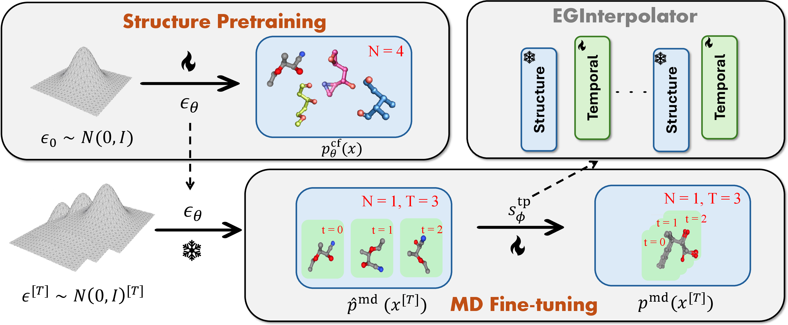

# Align Your Structures: Generating Trajectories with Structure Pretraining for Molecular Dynamics

Aniketh Iyengar\*<sup>1</sup>, Jiaqi Han\*<sup>1</sup>, Pengwei Sun\*<sup>1</sup>, Mingjian Jiang<sup>1</sup>, Jianwen Xie<sup>2</sup>, Stefano Ermon<sup>1</sup>

<sup>1</sup>Stanford University &nbsp;&nbsp; <sup>2</sup>Lambda, Inc.

\* equal contribution. Correspondence to `jiaqihan@stanford.edu`.

[arXiv](https://arxiv.org/abs/2604.03911) · License: MIT

This is the official implementation of *Align Your Structures: Generating
Trajectories with Structure Pretraining for Molecular Dynamics* (ICLR 2026).

<!-- TODO: overview figure -->


We decompose the MD-trajectory generation problem into two stages: a
**conformer-level diffusion backbone** that is pretrained on large-scale
structural data (GEOM-QM9, GEOM-DRUGS), and a **trajectory-level interpolator**
that stitches the frozen spatial backbone into a generator over MD
trajectories. We comprehensively evaluate our method on the QM9 and DRUGS small-molecule
datasets across unconditional generation, forward simulation, and interpolation
tasks, and further extend our framework and analysis to tetrapeptide and
protein monomer systems.

## Environment

```bash
conda env create -f environment.yml
conda activate align_your_structures
```

Pinned versions cover the full stack used in the paper (PyTorch 2.6 on CUDA
12.x, RDKit, OpenMM, OpenFF Toolkit, mdtraj, PyEMMA, PyTorch Lightning,
torch-geometric, scikit-learn-extra). Tested on Linux x86_64 with CUDA 12.4.

### Data path environment variable

Data-reading code uses one environment variable. Point it at wherever you
store the corresponding data:

```bash
export MD_DATA_ROOT=/path/to/md_data         # GEOM pkls + MD trajectories
```

## Dataset

### GEOM (QM9 and DRUGS)

Please refer to the [GeoDiff](https://github.com/MinkaiXu/GeoDiff) and
[ConfGF](https://github.com/DeepGraphLearning/ConfGF) codebases for details
on the conformer data. We use GeoDiff's archived train / validation pkls and
the ConfGF official test split. Our final preprocessed training files (in
loader-friendly dict format) are bundled on Zenodo:
[doi:10.5281/zenodo.19711753](https://doi.org/10.5281/zenodo.19711753).

After downloading, arrange the pkls so that:

```
${MD_DATA_ROOT}/processed_input_data/GEOM-QM9/GEOM-QM9_{Train,Val,Test}.pkl
${MD_DATA_ROOT}/processed_input_data/GEOM-DRUGS/GEOM-DRUGS_{Train,Val,Test}.pkl
```

### Molecular Dynamics data (Pre-simulated MD trajectories)

We release the pre-simulated MD trajectories used in the paper on Zenodo:

- GEOM-QM9: [doi:10.5281/zenodo.19675124](https://doi.org/10.5281/zenodo.19675124)
- GEOM-DRUGS: [doi:10.5281/zenodo.19676826](https://doi.org/10.5281/zenodo.19676826) (split into 2 parts — `cat *.part* > full.tar.gz` before extracting)

Extract so that:

```
${MD_DATA_ROOT}/output_trajectories/GEOM-QM9/4fs_HMR15_5ns_actual/{train,val,test}/
${MD_DATA_ROOT}/output_trajectories/GEOM-DRUGS/4fs_HMR15_5ns_actual/{train,val,test}/
```

To instead run the simulations yourself (5 ns, 4 fs timestep, HMR 1.5 amu,
100-step frame interval):

```bash
bash scripts_official/data_gen/data_gen.sh qm9   <gpu_id>
bash scripts_official/data_gen/data_gen.sh drugs <gpu_id>
```

Multi-GPU / SLURM wrappers live at `scripts_official/data_gen/launch_{slurm,jobs}.sh`.

## Training

All hyperparameters live in the YAML configs under `configs_official/`. Two
launchers, each takes one config path:

```bash
bash scripts_official/conformer/launch_slurm_conf.sh  <CONFIG_PATH>
bash scripts_official/trajectory/launch_slurm_traj.sh <CONFIG_PATH>
```

Both are plain bash — prepend `#SBATCH` directives or wrap for your scheduler.
Checkpoints land under `checkpoints/{wandb.project}/{wandb.name}/`.

**Stage 1 — conformer backbone.** Train first; the trajectory models load this
checkpoint.

```bash
bash scripts_official/conformer/launch_slurm_conf.sh \
    configs_official/conformer/qm9/qm9_noH_1000_kabsch_conf_basic_es_order_3.yaml
```

Swap `qm9` for `drugs` or `both` (joint) as needed.

**Stage 2 — trajectory model.** Point `denoiser.pretrain_ckpt` in the YAML at
a Stage-1 checkpoint, then:

```bash
bash scripts_official/trajectory/launch_slurm_traj.sh \
    configs_official/trajectory/qm9/qm9_noH_1000_kabsch_traj_interpolator_pretrain.yaml
```

Browse `configs_official/trajectory/{qm9,drugs,both}/` for additional variants

## Generation and evaluation

Evaluation pipelines live under `eval/pipelines/`, organized by task:

```
eval/pipelines/
├── conformer/      # conformer-level (COV / MAT)
├── trajectory/     # trajectory-level (bond / angle / torsion JSD, TICA)
├── interpolation/  # interpolation task
├── mdbaseline/     # raw MD reference comparisons
├── tetrapeptide/   # tetrapeptide-specific eval
├── energy/         # energy-based eval
├── smiles/         # SMILES lists consumed by the scripts above
└── utils.py        # shared helpers
```

Each script consumes a generation pickle and emits per-metric result files;
the companion `read_out_pkl_*.ipynb` notebook in each subdirectory turns
those into the paper CSV.

### Conformer (COV / MAT on GEOM)

```bash
python eval/pipelines/conformer/eval_conformer_model.py --use_drug --plot --num_workers 32
```

Edit `pkl_file_path` / `drug_pkl_file_path` at the top of the script to point
at your generation pickle.

### Trajectory: QM9 unconditional generation

```bash
python eval/pipelines/trajectory/eval_traj_pipeline.py \
    --no_msm --plot --num_workers 32 --save --save_name my_run \
    --gener_dir path/to/your_gen.pkl
```

`--no_msm` skips MSM analysis and keeps only the bond / angle / torsion /
TICA metrics used in Table 1. Default SMILES list:
`eval/pipelines/smiles/eval_qm9_unconditional_generation_smiles.txt` —
override with `--gener_smiles`.

### Trajectory: DRUGS forward simulation

```bash
python eval/pipelines/trajectory/eval_traj_pipeline_drugs.py \
    --no_msm --num_workers 2 \
    --gener_dir path/to/your_drugs_gen.pkl
```

## Tetrapeptide experiments

As an extension to the small-molecule pipeline above, the paper also reports
tetrapeptide dynamics experiments. These use trajectory data from two external
datasets that we do not redistribute here:

- Timewarp 4AA-large — [microsoft/timewarp](https://github.com/microsoft/timewarp)
- MDGen 4AA_sims — [bjing2016/mdgen](https://github.com/bjing2016/mdgen)

Download the raw data from the upstream sources and set:

```bash
export MDGEN_DATA_ROOT=/path/to/mdgen        # MDGen 4AA_sims
export TIMEWARP_DATA_ROOT=/path/to/timewarp  # Timewarp 4AA-large
```

Preprocessing scripts under `data_gen/preprocess/` (`process_timewarp*.py`,
`process_mdgen.py`, `sample_conformer_*.py`, `merge_mdwarp.py`) convert the
upstream data into the pkls consumed by the
`configs_official/{conformer,trajectory}/{tetrapeptide,timewarp,mdgen}/`
YAMLs.

## Acknowledgment

<!-- TODO: expand if needed -->

- The conformer-level evaluation (COV / MAT) builds on
  [ConfGF](https://github.com/DeepGraphLearning/ConfGF) and
  [GeoDiff](https://github.com/MinkaiXu/GeoDiff). We thank the authors for
  open-sourcing their code.
- GEOM dataset: Axelrod & Gómez-Bombarelli, *GEOM: energy-annotated
  molecular conformations*, Scientific Data 2022.
- Timewarp dataset: Klein *et al.*, *Timewarp: transferable acceleration of
  molecular dynamics by learning time-coarsened dynamics*, NeurIPS 2023.
- MDGen: Jing *et al.*, *MDGen: generative modeling of molecular dynamics
  trajectories*, 2024.
- Boltz-1: Wohlwend *et al.*, *Boltz-1: democratizing biomolecular
  interaction modeling*, 2024.

## Citation

```bibtex
@misc{iyengar2026alignstructuresgeneratingtrajectories,
      title={Align Your Structures: Generating Trajectories with Structure Pretraining for Molecular Dynamics},
      author={Aniketh Iyengar and Jiaqi Han and Pengwei Sun and Mingjian Jiang and Jianwen Xie and Stefano Ermon},
      year={2026},
      eprint={2604.03911},
      archivePrefix={arXiv},
      primaryClass={cs.LG},
      url={https://arxiv.org/abs/2604.03911},
}
```

## Contact

For questions, contact Jiaqi Han at `jiaqihan@stanford.edu`.
